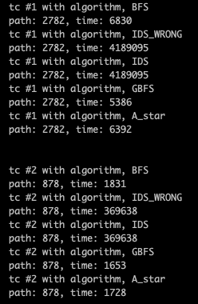
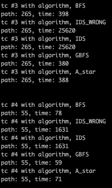
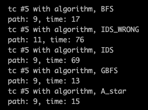

# Arithmetic Intelligence

## assignment1
- find the value R that satisfies the condition f(R)=0.01. (for each EPSILON value of 1e-4 and 1e-6)
- solve the problems: 8_32, 8_36
- 이전에 놓친 hw3에 해당하는 코드도 마저 정리하였고, 결과를 확인했습니다.

#### Quick Start
```
python 2016026080_assignment_1.py
```

#### Additional Works
- priority_queue and parser without using library
```
def push_pq(pq, node):
	pq.append(node)
	idx = len(pq)-1
	nidx=(idx-idx%2)/2
	while nidx>0 and pq[nidx][0]>pq[idx][0]:
		pq[idx]=pq[nidx]
		idx=nidx
		nidx=(idx-idx%2)/2
	pq[idx]=node

def pop_pq(pq):
	re = pq[1]
	max_idx=len(pq)-1
	idx = 1
	nidx = 2 + (3<=max_idx and pq[3][0]<pq[2][0])
	while nidx<=max_idx and pq[nidx][0]<pq[max_idx][0]:
		pq[idx]=pq[nidx]
		idx=nidx
		nidx=idx*2+(idx*2 + 1 <= max_idx and pq[idx*2+1][0]<pq[idx*2])
	pq[idx]=pq[max_idx]
	pq.pop()
	return re

def main():	
	'''
	# with argparse library
	parser = argparse.ArgumentParser()
	parser = argparse.ArgumentParser(description='manage test arguments')
 
	parser.add_argument('--tc_num', type=int, default=1)
	parser.add_argument('--tc_path', type=str, default='./')
	parser.add_argument('--tc_name', type=str, default='Maze')
	args=parser.parse_args()

	tc_num = args.tc_num
	tc_path = args.tc_path
	tc_name = args.tc_name
	'''
	
	# without argparse library
	tc_num=5
	tc_path='./'
	tc_name='Maze'
```
    외부 라이브러리 사용이 불가하여 priority queue를 직접 구현해서 사용했습니다.   
    parser의 경우, testing 환경에서는 직접 사용하였고, 제출시 주석처리하여 냈습니다.

- data manager
```
def load_map(file_name):
	file_txt = open(file_name, 'r')
	
	# load num, x, y
	line = file_txt.readline()
	line_list = list(map(int, line.rstrip("\n").split()))
	num,x,y = line_list
	
	# loat maze data
	maze=[]	
	for i in range(int(x)):
		line = file_txt.readline()
		maze.append(list(line)[:y])
	
	file_txt.close()
	
	return num,maze

def save_result(test_num, algorithm_name, maze, path, time):
	file_name = 'Maze_'+str(test_num)+'_'+algorithm_name+'_output.txt'
	file_txt = open(file_name, 'w')
	mx, my = get_map_size(maze)

	# update maze with the explored place
	for pt in path:
		maze[pt['x']][pt['y']]='5'
	# write result
	for i in range(mx):
		file_txt.writelines(' '.join(str(x) for x in maze[i]))
		file_txt.write('\n')

	file_txt.write('---\n')
	file_txt.write('length='+str(len(path)+1)+'\n')
	file_txt.write('time='+str(time))
	file_txt.close()

def get_map_size(maze):
	return len(maze), len(maze[0])

def extract_elements_from_map(maze):
	# 3: start point
	# 4: end point
	# 5: key point
	mx, my = get_map_size(maze)
	for i in range(mx):
		for j in range(my):
			now = maze[i][j]
			if now == '3':
				point_start = {'x' : i, 'y' : j}
			elif now == '4':
				point_end = {'x' : i, 'y' : j}
			elif now == '6':
				point_key = {'x' : i, 'y' : j}
	return point_start, point_end, point_key
```
	txt 파일의 input data로부터 정보를 읽어오고 필요한 정보를 추출하고, 결과값을 저장하는 함수 목록입니다.


- method pointer and structure
```
def bfs(maze, point_start, point_end):
def ids(maze, point_start, point_end):
def ids_wrong(maze, point_start, point_end):
def greedy_bfs(maze, point_start, point_end):
def a_star(maze, point_start, point_end):

search_algorithms = [
		{'func':bfs, 'name':'BFS'},
		{'func':ids_wrong, 'name':'IDS_WRONG'},
		{'func':ids, 'name':'IDS'},
		{'func':greedy_bfs, 'name':'GBFS'},
		{'func':a_star, 'name':'A_star'}]


```
    method 함수의 인자값 규격을 통일하여 같은 형태를 띄게 만들었습니다.   
 	main문에서는 필요한 함수를 가져와서 사용합니다.
 	ids_wrong함수의 경우, visit배열을 사용해서 ids알고리즘을 최적화하는 도중에 만들어진 잘못된 함수입니다. killer case가 존재하여 같이 코드에 넣어두었습니다. Maze_5.txt의 경우 killer case입니다.


#### Results
모든 algorithm에 대해서 complete함을 확인했습니다. 시간도 확인했습니다.




