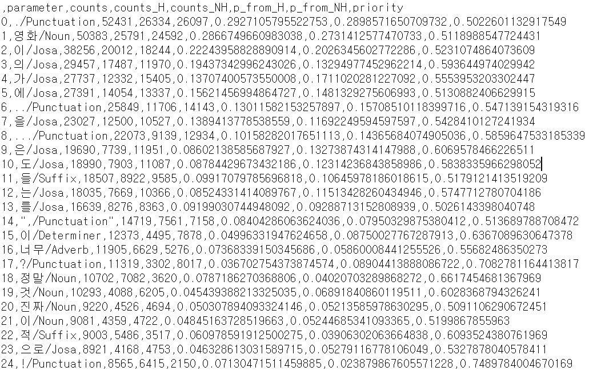
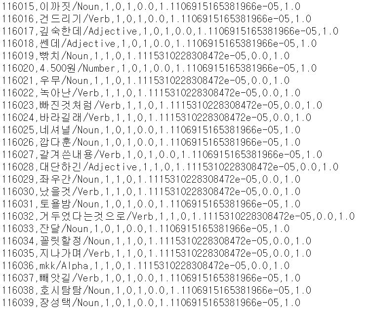
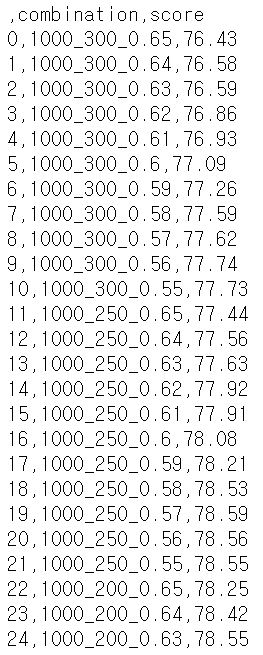
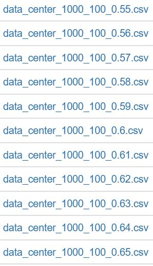
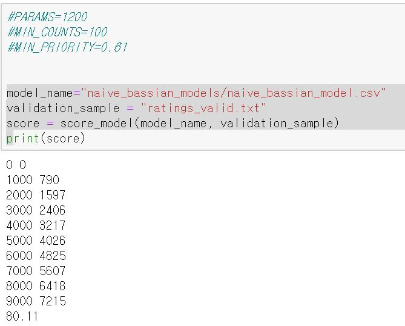

# Arithmetic Intelligence

## assignment2
- 영화 감상평 분류기 만들기

#### Quick Start
```
python 2016026080_assignment_2.py
or
jupyter notebook
실행 후 2016026080_assignment_2.ipynb 실행
```

#### Additional Works
- Pandas Library     
    csv 형식의 파일을 읽어오기 위해 Pandas Library를 사용했습니다. Series 구조체 등을 사용하여 코드를 간략화했습니다.     
    
- Twitter 형태소분석 Library     
    형태소분석 라이브러리를 사용하여 samples_training.txt의 모든 document들을 형태소들로 분해했습니다.      
    그리고 모든 형태소들에 대해서 확률값을 계산했고, 이것을 naive_bassian_models/BigDataCenter.csv에 저장했습니다.       

- BigDataCenter.csv     
    naive_bassian_models/BigDataCenter.csv 에서 내용을 확인하실 수 있습니다.     
    sample_training.txt에 있는 모든 document를 형태소 분석한 값이 나와있습니다.    
         
         
    형태소 분석한 값을 "단어/형태소" 로 정리하여 다른 형태소끼리 혼용되는 것을 막았습니다. (예시. "의/조사", "자동차/명사")     
    counts: 해당 형태소가 등장한 "문장"의 수     
    counts_H: 해당 형태소가 등장한, label값이 1인 "문장"의 수     
    counts_NH: 해당 형태소가 등장한, label값이 0인 "문장"의 수     
    p_from_H: label값이 1인 경우 중에서 해당 형태소가 나온 문장의 비율     
    p_from_NH: label값이 0인 경우 중에서 해당 형태소가 나온 문장의 비율     
    priority: optimize한 naive bassian model을 구성하는 형태소들을 쉽게 뽑기 위해 임의로 넣은 값     


- Optimizing 

```
def optimize_parameters():
    scores=[]
    for PARAMS in [1000,1100,1200,1300,1400]:
        for MIN_COUNTS in [300, 250, 200, 150, 100, 80]:
            for MIN_PRIORITY in [0.65, 0.64, 0.63, 0.62, 0.61, 0.60, 0.59, 0.58, 0.57, 0.56, 0.55]:

                #PARAMS=1000
                #MIN_COUNTS=100
                #MIN_PRIORITY=0.62
                model_name="naive_bassian_models/data_center_cases/data_center_"+str(PARAMS)+"_"+str(MIN_COUNTS)+"_"+str(MIN_PRIORITY)+".csv"
                make_DataCenter(model_name, PARAMS, MIN_COUNTS, MIN_PRIORITY)
                validation_sample = "ratings_valid.txt"
                score = score_model(model_name, validation_sample)
                print(score)
                scores.append({"combination":str(PARAMS)+"_"+str(MIN_COUNTS)+"_"+str(MIN_PRIORITY), "score": score})

    scores_pd = pd.DataFrame(scores)
    scores_pd.to_csv("naive_bassian_models/Result_optimizing_parameters.csv")

```

PARAMS: 파라미터(=형태소) 최대 개수     
MIN_COUNTS: 해당 파라미터(=형태소) 가 training_sample에서 등장한 문장의 최소 수     
MIN_PRIORITY: BigDataCenter.csv에 나온 형태소들의 최소 priority값     

PARAMS, MIN_COUTS, MIN_PRIORITY값을 바꿔가며 가장 높은 정확도를 보이는 경우를 탐색했습니다.     
각 케이스의 모델들은 naive_bassian_models/data_center_cases/ 경로 안에 저장되어 있습니다.     
     
     

#PARAMS=1200      
#MIN_COUNTS=100      
#MIN_PRIORITY=0.61    
인 경우에 sample_validation.txt에서 가장 높은 정확도를 보였습니다.     
   
   
- EM Algorithm    
EM algorithm을 사용하여 분류를 시도했습니다.   
em_models 폴더 안에 관련 데이터가 저장되어 있고, 2016026080_assignment_2.py, 2016026080_assignment_2.ipynb에 해당 내용이 작성되어 있습니다.   
하지만 영화관람평 데이터의 경우, 특정 문장에서만 등장하는 단어가 많고, 모든 경우의 수에 대해서 데이터의 수가 많지 않았습니다.   
그래서 처음엔 parameter 여럿을 묶어서 사용하는 방식으로 시도했습니다. 그러나 이 방식에도 한계가 있었고 결국 정확도는 validation_sample의 1의 비율값인 50.22%에 수렴했습니다. 즉 EM 알고리즘은 영화관람평 예측에는 적합하지 않음을 확인했습니다(혹은 데이터 가공이 더 필요함을 알게 되었습니다)

```
def make_em_tables(parameters, training_sample):
    
    ## probability_init.csv
    probability_init = [ 
        {"condition":parameter[0],"probability_from_H":0.5+(random.random()-0.5)/5,"probability_from_NH":0.5+(random.random()-0.5)/5} for parameter in parameters 
    ]
    probability_init_pd = pd.DataFrame(probability_init)
    probability_init_pd.to_csv("probability_init.csv")

    
    ## ptable_init.csv
    ptable_init = []
    for idx in range(2**len(parameters)):
        num=idx
        checks=[]
        data={}

        for i in range(len(parameters)):
            checks.append(num%2)
            num=int((num-num%2)/2)

        for i in range(len(parameters)):
            data[parameters[i][0]]=checks[len(parameters)-1-i]
        data["counts_H"]=0
        data["counts_NH"]=0
        data["probability_to_H"]=0.5
        data["probability_to_NH"]=0.5
        ptable_init.append(data)
        
        
    ## Update information of training data to ptable_init.csv
    sample = pd.read_csv(training_sample, "\t")
    sample_document = sample['document']
    sample_label = sample['label']

    for idx in range(sample.shape[0]):
        num=0
        # remove nan
        if sample_document[idx] == sample_document[idx]:
            num=get_em_idx(parameters, sample_document[idx])

        if sample_label[idx] == 1:
            ptable_init[num]['counts_H']+=1
        else:
            ptable_init[num]['counts_NH']+=1
    
    for idx in range(len(ptable_init)):
        psum=ptable_init[idx]['counts_H']+ptable_init[idx]['counts_NH']
        if psum==0:
            continue
        ptable_init[idx]['probability_to_H']=ptable_init[idx]['counts_H']/psum
        ptable_init[idx]['probability_to_NH']=ptable_init[idx]['counts_NH']/psum
    
    ptable_init_pd = pd.DataFrame(ptable_init)
    ptable_init_pd.to_csv("ptable_init.csv")
    
    return probability_init, ptable_init
    
def train_em_model(parameters, probability, ptable, iteration):
    ptable_lookup = pd.DataFrame(ptable)
    ptable_counts = pd.DataFrame(ptable)["counts_H"]

    H=0.5+(random.random()-0.5)/5
    for it in range(iteration):
        # update ptable
        for idx in range(len(ptable)):
            num=idx
            hsum=1
            nhsum=1
            for i in range(len(parameters)):
                if num%2 == 1:
                    hsum*=probability[i]['probability_from_H']
                    nhsum*=probability[i]['probability_from_NH']
                else:
                    hsum*=1-probability[i]['probability_from_H']
                    nhsum*=1-probability[i]['probability_from_NH']
                num=int((num-num%2)/2)
            ptable[idx]['probability_to_H']=hsum/(hsum+nhsum)
            ptable[idx]['probability_to_NH']=1-hsum/(hsum+nhsum)

        
        # update probability
        ptable_p = pd.DataFrame(ptable)["probability_to_H"]
        ptable_np = pd.DataFrame(ptable)["probability_to_H"]
        
        H=(ptable_counts*ptable_p).sum()/ptable_counts.sum()
        for idx in range(len(parameters)):
            parameter=parameters[idx]
            param=parameter[0]
            idxs = np.where(ptable_lookup[param]==1)[0].astype(int)
            
            probability[idx]['probability_from_H'] = (ptable_counts[idxs]*ptable_p[idxs]).sum()/ptable_counts[idxs].sum()
            probability[idx]['probability_from_NH'] = (ptable_counts[idxs]*ptable_np[idxs]).sum()/ptable_counts[idxs].sum()
        
        # scoring to know when to stop training
        print("iteration : " + str(it) + "\tscore: " + str(score_em_model(parameters, ptable_p, "./ratings_data/ratings_valid.txt")))

    ptable_pd = pd.DataFrame(ptable)
    ptable_pd.to_csv("ptable_trained.csv")
    probability_pd = pd.DataFrame(probability)
    probability_pd.to_csv("probability_trained.csv")
    return probability, ptable
    
parameters=[
    ["재미", "재밋", "재밌", "꿀잼"], 
    ["감동", "슬프", "슬퍼", "슬픔", "멋", "멋지", "멋짐", "멋져"],
    ["욕", "ㅅㅂ", "노잼", "별로", "아니"]
]
training_sample = "./ratings_data/ratings_train.txt"

probability, ptable = make_em_tables(parameters, training_sample)
```

#### Code Review     

```
def generate_BigDataCenter(filename):
    
    samples = pd.read_csv(filename, "\t")
    documents = samples["document"]
    labels = samples["label"]

    big_data_center = []
    dc_idxs={}

    for idx in range(len(documents)):
        if idx%500 == 0:
            print(idx)
        document=documents[idx]
        label=labels[idx]

        # filter nan
        if(document!=document):
            continue

        tokens = ['/'.join(t) for t in twitter.pos(document, norm=True)]
        repeat={}
        for token in tokens:
            if token in repeat:
                continue
            repeat[token]=1

            if token in dc_idxs:
                big_data_center[dc_idxs[token]]["counts"]+=1
                big_data_center[dc_idxs[token]]["counts_H" if label==1 else "counts_NH"]+=1
            else:
                dc_idxs[token]=len(big_data_center)
                big_data_center.append({"parameter":token, "counts":1, "counts_H":0, "counts_NH":0, "p_from_H":0, "p_from_NH":0, "priority":0})
                big_data_center[dc_idxs[token]]["counts_H" if label==1 else "counts_NH"]+=1

    H_NUM = len(np.where(labels==1)[0])
    NH_NUM = len(np.where(labels==0)[0])

    for data in big_data_center:
        data["p_from_H"]= data["counts_H"]/H_NUM
        data["p_from_NH"]= data["counts_NH"]/NH_NUM
        data["priority"]=max([ data["counts_H"],data["counts_NH"] ])/(data["counts"]) 

    sorted_big_data_center = sorted(big_data_center, key=lambda data:(data["counts"], data["priority"]))
    sorted_big_data_center.reverse()
    
    pd.DataFrame(sorted_big_data_center).to_csv("naive_bassian_models/BigDataCenter2.csv")
    
    for data in sorted_big_data_center[:10]:
        print(data)
        
def make_DataCenter(filename, num_of_parameter, min_counts, min_priority):
    big_data_center_pd = pd.read_csv("naive_bassian_models/BigDataCenter.csv")
    priorities=big_data_center_pd["priority"]
    columns=big_data_center_pd.columns
    idxs=np.where(priorities>=min_priority)[0].astype(int)

    data_center=[]
    for idx in idxs:
        if (len(data_center)==num_of_parameter) or (big_data_center_pd["counts"][idx]<min_counts):
            break

        node ={}
        for column in columns:
            node[column]=big_data_center_pd[column][idx]
        data_center.append(node)

    pd.DataFrame(data_center).to_csv(filename)
    print("Make Datacenter with len: "+str(len(data_center)))
```
BigDataCenter과 파라미터값에 따른 DataCenter를 만드는 함수입니다.      

```
def score_model(model_name, sample_name):
    data_center_pd = pd.read_csv(model_name)
    parameters=data_center_pd["parameter"]
    p_H=data_center_pd["p_from_H"]
    p_NH=data_center_pd["p_from_NH"]
    
    samples=pd.read_csv(sample_name, "\t")
    documents=samples["document"]
    labels=samples["label"]
    
    score=0
    for idx in range(len(documents)):
        if idx%1000 == 0:
            print(idx, score)
        document=documents[idx]
        label=labels[idx]
        if get_label(parameters, p_H, p_NH, document)==label:
            score+=1
    
    return score*100/len(documents)
            
 def get_label(parameters, P_H, P_NH, document):
    if document != document:
        return 1
    
    MULFACTOR=10000
    MINFACTOR=0.000001
    p_H=math.log(MULFACTOR*89966/180000)
    p_NH=math.log(MULFACTOR*90034/180000)
    tokens = ['/'.join(t) for t in twitter.pos(document, norm=True)]
    for idx in range(len(parameters)):
        parameter=parameters[idx]
        if parameter in tokens:
            p_H += math.log(MULFACTOR * max([P_H[idx], MINFACTOR]))
            p_NH += math.log(MULFACTOR * max([P_NH[idx], MINFACTOR]))
        else:
            p_H += math.log(MULFACTOR * max([1-P_H[idx], MINFACTOR]))
            p_NH += math.log(MULFACTOR * max([1-P_NH[idx], MINFACTOR]))
            
    return 1 if p_H>=p_NH else 0
                   
```
형태소 조합의 성능판단을 위한 score, labeling 함수입니다.     
score는 특정 샘플에대한 점수를 반환하고, get_label함수의 경우 예상되는 label값을 반환하는 함수입니다.     


#### Results
   



### Additional Results

stem optimize+data smoothing를 추가로 거쳐서 정확도를 늘렸습니다.
예상과는 다르게 parameter가 늘수록 정확도가 늘어서 값만 바꾸어 다시 돌리는 중입니다


