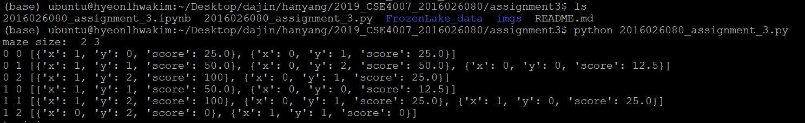
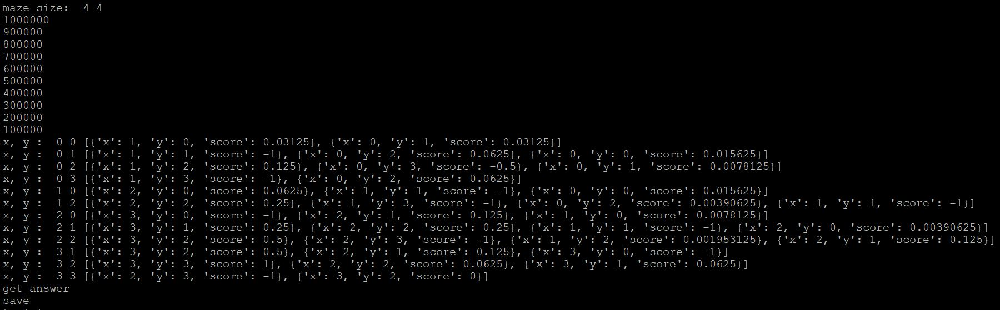
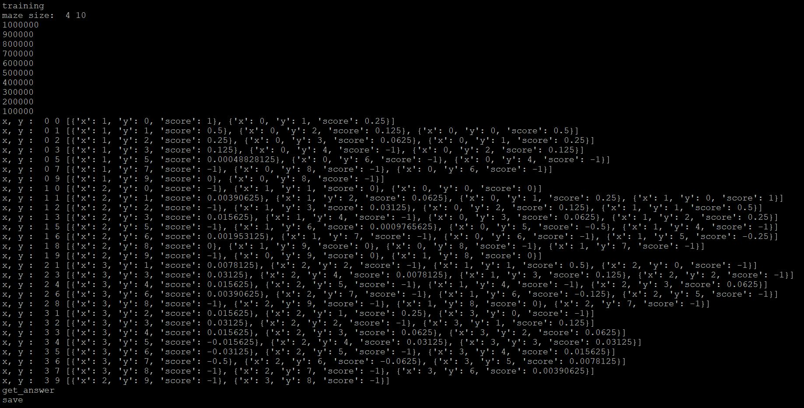
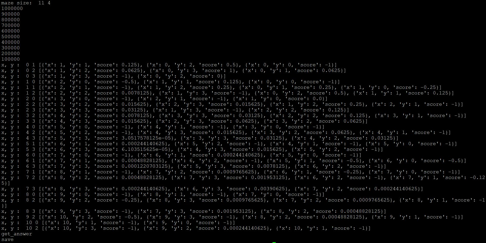

# Arithmetic Intelligence

## assignment3
- solve maze problem via QLearning method

#### Quick Start
```
python 2016026080_assignment_3.py
or
jupyter notebook
실행 후 2016026080_assignment_3.ipynb 실행
```

#### Works
- load and save txt file   
assignment1의 코드를 참고하여 재사용했습니다.   
load_map(file_name), save_result(tc, maze, path)함수로 데이터를 읽고 씁니다.      

- Manage the maze data
make_data_table(maze) 함수로 data table을 형성합니다. 선언해놓은 다음 G,S위치를 확인하여 시작좌표와 종료좌표의 위치 또한 반환합니다.   

- q_learning_example, dfs_all
강의 피피티에 있는 예제를 코드로 작성한 결과입니다. 탐색하는과정을 dfs_all로 했고, 여러 epoch에 걸쳐서 돌리도록 관리하는 함수를 q_learning_example함수로 작성했습니다. q_learning_example함수가 dfs_all함수를 호출하여 코드가 진행이 됩니다. 여기서 전체 맵의 정보가 나와있고 그 크기가 작을 경우 단순한 dfs로 푸는 것이 훨씬 빨리 끝날 수 있음을 알게 되었습니다.

- q_learning, dfs
q learning 과제를 돌리는 함수입니다. 자세한 내용은 아래 code review에 작성하겠습니다.

#### Code Review     

```
def q_learning(func, maze, point_start, point_end, data_table, epoch):
    mx,my=maze.shape[:2]
    print("maze size: ", mx, my)
    
    ## training
    while epoch>0:
        if epoch%100000 == 0:
            print(epoch)
        isSuccess, path, new_data_table = func(maze, data_table, point_start, point_end)
        epoch-=1
    
    return new_data_table

def dfs(maze, data_table, point_start, point_end, path="RANDOM"):
    # set the arguments
    mx,my=maze.shape[:2]
    stack=[]
    trace=[]
    isSuccess=False
    threshold=0.1
    
    # dfs search
    stack.append({'pt':point_start, 'level':0})
    while stack:
        now = stack.pop()
        pt=now['pt']
        level=now['level']
        if pt not in trace:
            trace.append(pt)
        ## End Condition
        if pt['x'] == point_end['x'] and pt['y'] == point_end['y']:
            isSuccess=True
            break
        elif maze[pt['x']][pt['y']]=='H':
            isSuccess=False
            break
        
        
        if path=="RANDOM":
            # get the next point. for training
            if random.uniform(0,1)>0.0:
                #print("random")
                nums = len(data_table[pt['x']][pt['y']])
                num = random.randint(1,nums)-1
                idx=num
                pt_next_info = data_table[pt['x']][pt['y']][idx]
                pt_next = {'x':pt_next_info['x'],'y':pt_next_info['y']}
                
                cnt=2
                while pt_next in trace:
                    num = random.randint(1,nums)-1
                    idx=num
                    pt_next_info = data_table[pt['x']][pt['y']][idx]
                    pt_next = {'x':pt_next_info['x'],'y':pt_next_info['y']}
                    
                    cnt-=1
                    if cnt==0:
                        break
                        
            else:
                #print("best")
                pt_next_info = max(data_table[pt['x']][pt['y']], key = (lambda k : k['score']))
                pt_next = {'x':pt_next_info['x'],'y':pt_next_info['y']}
                
                idx = get_pt_idx(data_table[pt['x']][pt['y']], pt_next)
            ## get the first random next_spot
            if pt_next['x'] == point_end['x'] and pt_next['y'] == point_end['y']:
                data_table[pt['x']][pt['y']][idx]['score'] = 1
            elif maze[pt_next['x']][pt_next['y']]=='H':
                data_table[pt['x']][pt['y']][idx]['score'] = -1
            else:
                #max_score = max(data_table[pt_next['x']][pt_next['y']]  , key = (lambda k : k['score']))['score']
                max_score = get_max_score(data_table[pt_next['x']][pt_next['y']], pt)
                data_table[pt['x']][pt['y']][idx]['score'] = 0.5*max_score
            stack.append({'pt':pt_next, 'level':level+1})
        
        else:
            # get the next point. with highest score
            pt_next_info = max(data_table[pt['x']][pt['y']], key = (lambda k : k['score']))
            pt_next = {'x':pt_next_info['x'],'y':pt_next_info['y']}
            
            stack.append({'pt':pt_next, 'level':level+1})
        
        
    # searching failed
    if not isSuccess:
        return isSuccess, [], data_table
    #print("SUCCESS!!!")
    return isSuccess, trace, data_table

```
한번의 탐색에 해당하는 함수가 dfs이고, 이것을 여러 epoch돌리는 함수가 q_learning 함수입니다. dfs함수의 경우 assignment1의 내용을 참고하여 재사용했습니다. 매번 탐색때마다 dfs함수를 통해 탐색을 하고, 지나가는 자리의 score값을 다시매기며 동작합니다. 'G'이나 'H'를 만나는 시점에서 탐색이 종료되고 scoring을 하도록 설정했습니다.

```
def make_data_table(maze):
    data_table=[]
    point_start={}
    point_end={}
    xx=[1,0,-1,0]
    yy=[0,1,0,-1]
    mx, my = maze.shape[:2]
    for x in range(mx):
        data_table.append([])
        for y in range(my):
            if maze[x][y]=='G':
                point_end={'x':x, 'y':y}
            elif maze[x][y]=='S':
                point_start={'x':x, 'y':y}
                
            adj_points=[]
            for idx in range(4):
                nx = x+xx[idx]
                ny = y+yy[idx]
                score=0
                if nx>=0 and nx<mx and ny>=0 and ny<my: #and maze[nx][ny] != 'H':
                    if maze[nx][ny]=='H':
                        score=-1
                    adj_points.append({'x':nx,'y':ny,'score':score})
            data_table[x].append(adj_points)
    return data_table, point_start, point_end

def get_max_score(dt, pt_from):
    score=-1
    for data in dt:
        if data['x']==pt_from['x'] and data['y']==pt_from['y']:
            continue
        if score<data['score']:
            score=data['score']
            
    return score

def get_pt_idx(table, pt):
    for idx in range(len(table)):
        if pt['x']==table[idx]['x'] and pt['y']==table[idx]['y']:
            return idx


def print_dt(maze, dt):
    mx,my=len(dt), len(dt[0])
    for x in range(mx):
        for y in range(my):
            if maze[x][y]=='H':
                continue
            print("x, y : ", x, y, dt[x][y])

```
위의 동작을 돕고 확인하기 위한 함수들입니다. make_data_table 함수를 통해 data_table을 만듭니다. 여기서 data_table이란 하나의 셀에서 다른 셀로 이동하는 action을 할 때 드는 score정보를 저장한 data table입니다. print_dt는 training이 끝난 후 data_table정보를 확인하기 위한 함수입니다. 'H'가 아닌 셀들의 data_table정보를 출력합니다.    
get_pt_idx는 next_point가 주어졌을때, 그것이 data_table[now_x][now_y]의 몇번째 action인지 가져오는 함수입니다.   

get_max_score()함수는 scoring을 할 때 사용하는 max(next_state)의 값을 보다 더 효과적으로 가져오도록 개량한 함수입니다. 자세한 내용은 Additional_Results에서 설명하도록 하겠습니다.


#### Results
   






### Additional Results
1. 작은 maze의 경우 단순히 dfs로 모든 경로를 탐색하는 것이 훨씬 빠르다는 것을 확인했습니다.
2. get_max_score함수를 사용하여 max(next_state)정보를 가져오는 방식을 바꾸었습니다.
- 기존방식
Q(state_now) = r + k x max(Q(state_next))   
Q(state_now) = r + k x max(Q(state_next to state_next_next1),Q(state_next to state_next_next2),Q(state_next to state_next_next3),Q(state_next to state_now))   
바꾼방식: Q(state_now) = r + k x max(Q(state_next))   
Q(state_now) = r + k x max(Q(state_next to state_next_next1),Q(state_next to state_next_next2),Q(state_next to state_next_next3))   

즉 한번 지나간 경로로 다시 돌아오지 않게끔 score 함수를 개선했습니다. 그 결과 FrozenLake_2.txt에 대해서 1000000번 해야지 정상적인 결과가 나오던 것을, 1000000번만에 배울 수 있도록 성능을 개선시켰습니다.

3. optimization
일반적으로 q learning을 최적화할 때, 10%의 확률로는 랜덤하게, 90%의 확률로 score값이 높은 경로를 택하는 것이 보편적이라고 합니다. trainin시에 말입니다. 그래서 이것을 training할 때 적용해 보았으나 저희 테스트 케이스에 대해서는 적합하지 않음을 확인했습니다. data_table의 값이 모두 0으로 초기화되어있기 때문에 greedy하게 score가 가장 높은 것을 택할 경우 모두 탐험되지 않은 영역으로 가게 됩니다. 그래서 목적지까지 도달하는 경우의 수가 줄어들어서 학습 속도가 매우 느려짐을 확인했습니다.