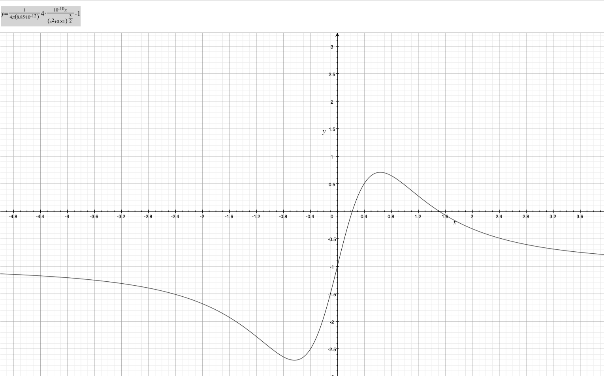
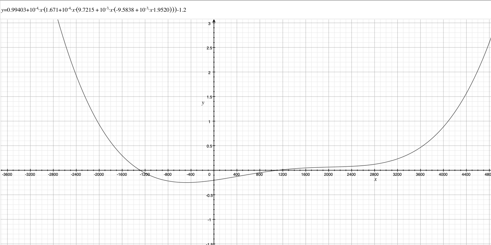
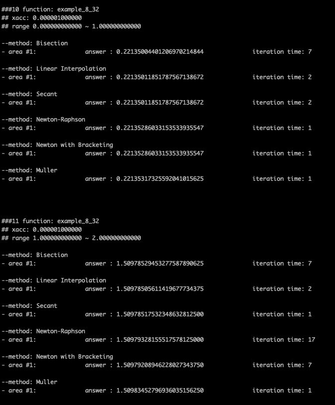

# Numerical Analysis

## hw4
- find the value R that satisfies the condition f(R)=0.01. (for each EPSILON value of 1e-4 and 1e-6)
- solve the problems: 8_32, 8_36

#### Quick Start
```
cd hw4
gcc -o main main.c -lm
./main
```

#### Additional Works
- method pointer and structure
```
# main.c
typedef float(*method_ptr)(funcdPtr, float, float, float, int*);

// method struct
typedef struct method{
	method_ptr ptr;
	char* name;
}method;

method methods[6] = {
	{rtbis, "Bisection"}, 
	{rtflsp, "Linear Interpolation"}, 
	{rtsec, "Secant"}, 
	{rtnewt, "Newton-Raphson"}, 
	{rtsafe, "Newton with Bracketing"},
	{muller, "Muller"}
};


# methods.c
void zbrak(void (*funcd)(float, float *, float *), float x1, float x2, int n, float xb1[], float xb2[], int *nb);
float rtbis(void (*funcd)(float, float *, float *), float x1, float x2, float xacc, int* iter);
float rtflsp(void (*funcd)(float, float *, float *), float x1, float x2, float xacc, int* iter);
float rtsec(void (*funcd)(float, float *, float *), float x1, float x2, float xacc, int* iter);
float rtnewt(void (*funcd)(float, float *, float *), float x1, float x2, float xacc, int* iter);
float rtsafe(void (*funcd)(float, float *, float *), float x1, float x2, float xacc, int* iter);
float muller(void (*funcd)(float, float *, float *), float x1, float x2, float xacc, int* iter);
```
    method 함수의 인자값 규격을 통일하여 같은 형태를 띄게 만들었습니다.   
    미분한 방정식이 필요한 method와 미분한 방정식이 필요하지 않은 method를 하나의 형태로 정리하고자 했습니다.   

    1. 처음에는 기존의 method 함수의 코드를 수정하지 않고, 함수 내에 새로운 함수를 선언하여 사용하고자 하였으나, 관련된 방식을 찾으려 해도 찾을 수 없었습니다. 후에 더 찾아보니 c언어의 경우 nested한 방식의 코드를 지원하지 않기 때문에 사실 불가능한 방법이었음을 알게 되었습니다.
    2. 두번째로 시도한 방식은 void * 타입으로 기존 함수를 한번 wrapping하여 사용하는 것이었습니다. 하지만 이 경우 역시 실패했습니다. return 자료형이 다른 여러 함수를 뭉치는 것은 가능했으나, 결국 argument를 통일하지 않고선 하나의 func pointer 규격으로 맞출 수 없었습니다.
    3. 그래서 마지막으로 선택한 방식이 method 함수들의 return타입, 인자타입들을 통일하는 것 이었습니다. 

- function pointer and structure
```
# main.c
typedef void(*funcdPtr)(float,float*,float*);

typedef struct funcd{
	funcdPtr ptr;
	char* name;
	float lx;
	float rx;
	float xacc;
}funcd;

funcd functions[12] = {
	{bessel, "Bessel function", 1.0, 10.0, 0.000001}, 
	{myfunc_1, "myfunc_1", 0.1, 1.0, 0.000001}, 
	{myfunc_2, "myfunc_2", 0.0, 1.0, 0.000001}, 
	{myfunc_3, "myfunc_3", -2.0, -1.0, 0.000001},
	{myfunc_4, "myfunc_4", -1.0, 1.0, 0.000001},
	{myfunc_5, "myfunc_5_F(R)", -320.0, -310.0, 0.0001},
	{myfunc_5, "myfunc_5_F(R)", 320.0, 330.0, 0.0001},
	{myfunc_5, "myfunc_5_F(R)", -320.0, -310.0, 0.000001},
	{myfunc_5, "myfunc_5_F(R)", 320.0, 330.0, 0.000001},
	{example_8_32, "example_8_32", 0.0, 2.0, 0.000001},
	{example_8_36, "example_8_36", 1120.0, 1130.0, 0.000001},
	{example_8_36, "example_8_36", -1300.0, -1280.0, 0.000001}
};

# functions.c
void bessel(float, float*, float*);
void myfunc_1(float, float*, float*);
void myfunc_2(float, float*, float*);
void myfunc_3(float, float*, float*);
void myfunc_4(float, float*, float*);
void myfunc_5(float, float*, float*);
void example_8_32(float, float*, float*);
void example_8_36(float, float*, float*);
```
    method 함수에 대해서 argument 구조를 통일했기 때문에, 모든 function 함수 역시 구조를 통일했습니다. 첫번째 인자로 x좌표를 주고, 두번째 인자와 세번째 인자에서 레퍼런스를 사용하여 y값과 dy값을 반환해주는 방식을 채택했습니다.   

    function 구조체의 경우, 새로 나오는 함수에 대해서 추가하기 수월하도록 구조화했습니다.   
    함수 포인터, 함수 이름, 찾고자 하는 x값의 범위, EPSILON값을 한데 넣어주었습니다.

#### Graphs
.png)



#### Results
_1e-4.png)
_1e-6.png)



###### main.c의 상단에서 N, NB값을 수정할 수 있고, method마다 최대한 돌릴 iteration 수는 methods.c 의 상단에서 수정할 수 있습니다.

