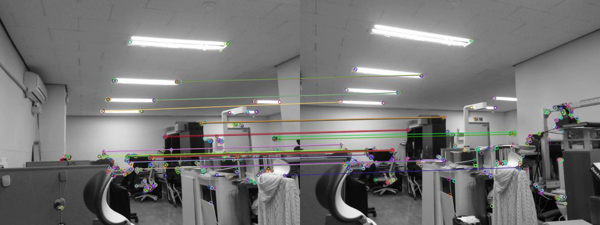
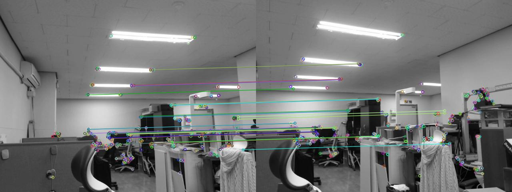

# Numerical Analysis

## hw10
- Nonlinear data fitting

#### Quick Start
```
cd hw10
python datafitting.py

or
jupyter notebook 실행 후 datafitting.ipynb 실행
```

#### Additional Works
1. 지난번과 마찬가지로 python 환경에서 과제를 수행했습니다.
역함수의 경우 hw9에서 구현을 하였으나, 파이썬환경에서 다시 짜는 것은 시간적으로 무리라고 판단하여 이번 과제에 대해서만 np안에 내장되어있는 역함수를 구하는 함수를 사용했습니다.

2. 그 외 Gaussian Noise, Keypoint pair 찾아오는 함수, Hessian matrix만드는 함수, 그리고 과제 수행에 필요한 잡다한 함수를 작성했습니다.

#### Report

-image load
이미지 정보는 c++ 샘플 코드에 있는것과 동일하게 ORB디텍터를 사용하여 이미지의 특징점을 색출하고 그것을 BruteForce Norm_Hamming 방식으로 추려냈습니다.

-Gaussian Noise
c++ 샘플 코드를 참고하여 유사하게 동작하도록 작성했습니다.

-R function
오차값을 나타내는 함수를 다음과 같이 사용했습니다.    
x_ = f1(x,y,a1,b1,c1,d,e...)
y_ = f2(x,y,a2,b2,c2,d,e...)

그래서 Hessian matrix를 두개 사용하여 각각 값에 따라서 a1,b1,c1,a2,b2,c2값이 변하도록 설정했습니다. 그리고 d,e의 경우는 hessian matrix를 거쳐서 나온 변화값의 평균값으로 변화시켜주었습니다.   

- initial state의 경우 사진 정보를 활용하여 정했습니다.
전체 pair들의 이동이 transition이라 가정하였고, 그래서 평균적인 상대오차를 사용했습니다.
```
	na1=a1-re_x[0]
    nb1=b1-re_x[1]
    nc1=c1-re_x[2]

    na2=a2-re_y[0]
    nb2=b2-re_y[1]
    nc2=c2-re_y[2]

    nnp=p-(re_x[3]+re_y[3])/2
    nnq=q-(re_x[4]+re_y[4])/2
```

그리고 lambda 값의 변화가 너무 심해지는 것을 방지하기 위해 한계를 설정했습니다.


```
 		Nerror_x, Nerror_y = get_errors(na1,nb1,nc1,na2,nb2,nc2,nnp,nnq,Left,Right)

        if Nerror_x+Nerror_y>=error_x+error_y:
            Nlambda*=Mulambda
            if Nlambda>10e60:
                Nlambda=10e60
                break
        else:
            Nlambda/=Mulambda
            if Nlambda<10e-60:
                Nlambda=10e-60
            break

```

- Hessian Matrix, gradients and errors
```
def make_Hessians(a1,b1,c1, a2,b2,c2, p,q, Left,Right):
    H_x=np.array([[0.0 for _ in range(5)] for __ in range(5)])
    H_y=np.array([[0.0 for _ in range(5)] for __ in range(5)])
    for i in range(5):
        for j in range(5):
            H_x[i][j]=sums(i,j,a1,b1,c1,p,q,Left,Right)
            H_y[i][j]=sums(i,j,a2,b2,c2,p,q,Left,Right)
    return H_x, H_y

def get_gradients(a1,b1,c1,a2,b2,c2, p,q, Left,Right):
    global funcs, divisor,f,g
    gradient_x=[0.0 for _ in range(5)]
    gradient_y=[0.0 for _ in range(5)]
    for idx in range(len(Left)):
        x=Left[idx][0]
        y=Left[idx][1]
        nx=Right[idx][0]
        ny=Right[idx][1]
        rf=f(p,q,x,y)
        rg1=g(a1,b1,c1,x,y)
        rg2=g(a2,b2,c2,x,y)
        dx = nx - rg1/rf
        dy = ny - rg2/rf
        for gidx in range(5):
            gradient_x[gidx]+=dx*funcs[gidx](a1,b1,c1,p,q,x,y,"USE",rf,rg1)
            gradient_y[gidx]+=dy*funcs[gidx](a2,b2,c2,p,q,x,y,"USE",rf,rg2)
    
    for gidx in range(5):
        gradient_x[gidx]*=-2
        gradient_x[gidx]/=divisor
        gradient_x[gidx]/=divisor
        gradient_y[gidx]*=-2
        gradient_y[gidx]/=divisor
        gradient_y[gidx]/=divisor
            
    return np.array(gradient_x), np.array(gradient_y)

def get_errors(a1,b1,c1,a2,b2,c2, p,q, Left,Right):
    global divisor,f,g
    error_x=0.0
    error_y=0.0
    
    for idx in range(len(Left)):
        x=Left[idx][0]
        y=Left[idx][1]
        nx=Right[idx][0]
        ny=Right[idx][1]
        rf=f(p,q,x,y)
        rg1=g(a1,b1,c1,x,y)
        rg2=g(a2,b2,c2,x,y)
        dx = nx - rg1/rf
        dy = ny - rg2/rf
        error_x+=dx*dx
        error_y+=dy*dy

    error_x/=divisor
    error_x/=divisor
    #error_x/=len(Left)
    error_y/=divisor
    error_y/=divisor
    #error_y/=len(Left)
    return error_x, error_y

```

매 사이클 마다 값을 가져오도록 함수를 설정했고, 같은 연산이 반복되는 것을 최대한 피하고자 몇몇 인자("USE"라고 한 인자)에 처리를 했습니다.


### RESULT
initial parameter값이 잘못 된 경우 이상한 값에 수렴하는 경우를 많이 발견했습니다.

올바른 initial state에서 시작한 경우 금새 수렴하여 좋은 결과를 내는 것을 확인했습니다.

noise가 낀 경우 정확도가 심각하게 떨어지는 것 역시 확인했습니다.




