# Numerical Analysis

## hw6
- make Random Number Generator - with Uniform and Gaussian Distribution


### Quick Start
```
cd hw6
gcc -o main main.c -lm
./main
```

### Report
##### 사용한 용어 정리
```
samples: data의 개수.
sections: 과제명세서상의 intervals. 구간을 나눈 개수. 
interval: 한 섹션이 차지하는 x값의 범위
```

##### 시행착오
- First Trial: samples 수 만큼의 행을 갖는 csv파일을 main.c로 만들고 그것을 python&jupyter notebook 을 통해 그래프로 만들기
```
samples 수가 100,10000인 경우까지는 로드하여 그래프를 그릴 수 있었으나, 1000000개의 행을 갖는 엑셀의 경우, load 하는데 문제가 생겼습니다.
```

- Second Trial: sections 수 만큼의 행을 갖는 csv 파일을 main.c로 만들고, 그것을 excel 파일을 통해 그래프로 만들기
```
main.c 내부에서 난수가 생성될 때 마다, 어느 section에 속하는지 체크 후, 그것을 (section number, counts)형식으로 csv 파일로 출력했습니다.
그러나, interval계산을 꼼꼼히 하지 못해, uniform random distribution에서 양 끝 section에서의 cnt 수가 다른 section의 cnt값의 반으로 나오는 결과가 발생했습니다. 코드 수정 후 해결했습니다.
```

- Third Trial: sections 수 만큼의 행을 갖는 csv 파일을 main.c로 만들고, 그것을 jupyter notebook으로 그래프로 만들기
```
main.c로 csv파일을 distributions directory에 만들고, 
make_graph.ipynb로 csv파일을 읽어와 그래프를 만들고, imgs directory에 이미지 파일로 저장했습니다.
```

##### 코드설명
```
typedef double(*funcPtr)(double, double, int*);
typedef struct distributor{
    funcPtr func;
    char* name;
    double arg1;
    double arg2; 
} distributor;

double uniform_random(double l, double r, int* idum);
double gaussian_random(double  m, double s, int* idum);
void make_distribution(distributor generator, int sections, int samples);

distributor distributors[2] = {
    { uniform_random, "Uniform Distribution", -3.0, 2.0 },
    { gaussian_random, "Gaussian Distribution", -0.5, 1.5 }
}; 
```
function ptr 사용하여 uniform random, gaussian random 함수 모두 돌아가게끔 설계

```
double uniform_random(double l, double r, int* idum){
    double p = ran1(idum);
    return l + (r-l)*p;
}
double gaussian_random(double  m, double s, int* idum){
    double n = gasdev(idum);
    return n*s + m;
}
```
gasdev.c 파일의 내용을 참고하여 작성했습니다. 0과 1 사이의 값이 나오는 ran1 함수를 사용하여 원하는 영역 내에서만 값이 나오도록 했습니다.

```
// make distribution
	int cnt[201] = { 0 };
	for(int i=0;i<samples;i++){
	    double num;
	    do{
	        num = func(arg1, arg2, &idum);
	    }while(num<l || num>r);
	    int step = (int)((num-l)/interval);
	    cnt[step]++;
	}
```
make_distribution 함수 내의 일부 코드입니다.    
func 함수는 uniform_random, gaussian_random 함수 둘중 하나를 가리키는 함수포인터입니다.    
###### l과 r은 카운트할 난수의 최솟값과 최댓값입니다. l보다 작거나, r보다 크거나 같은 난수는 체크하지 않았습니다.

##### Result
- imgs
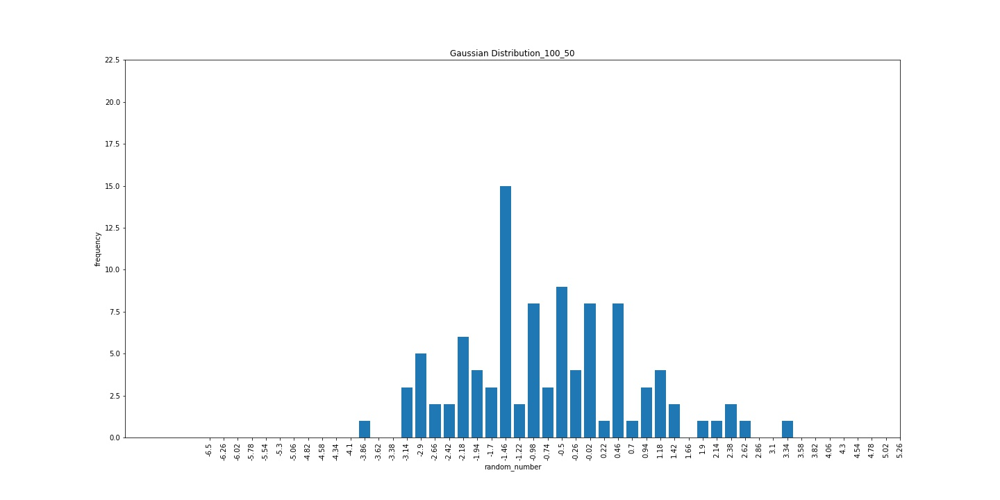
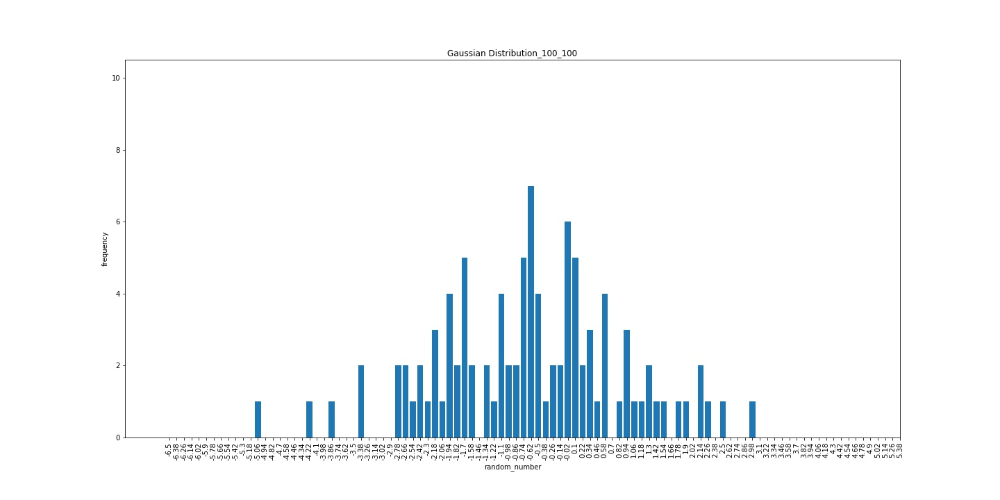
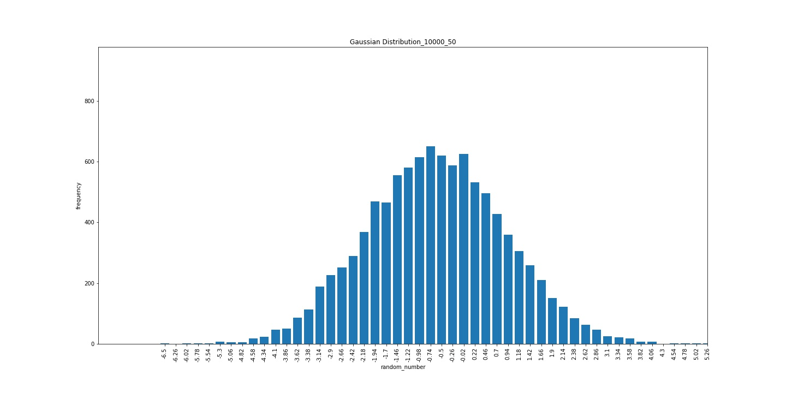
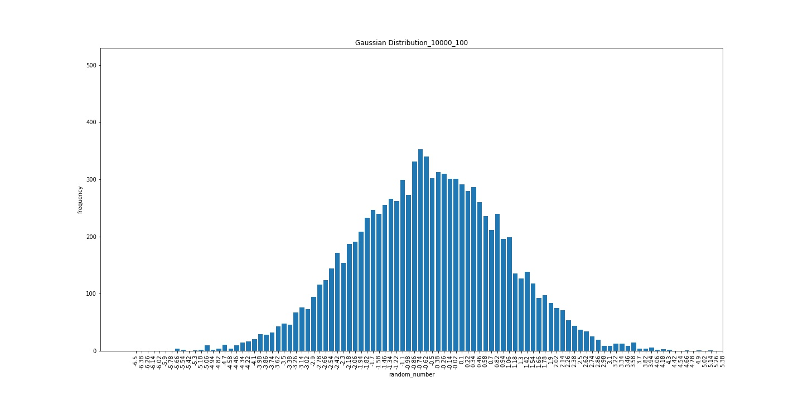

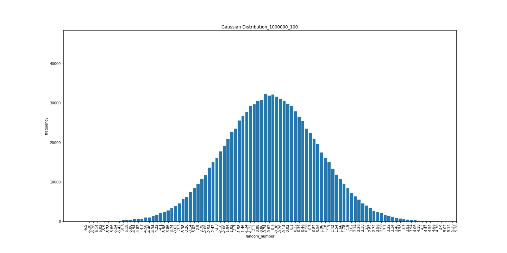
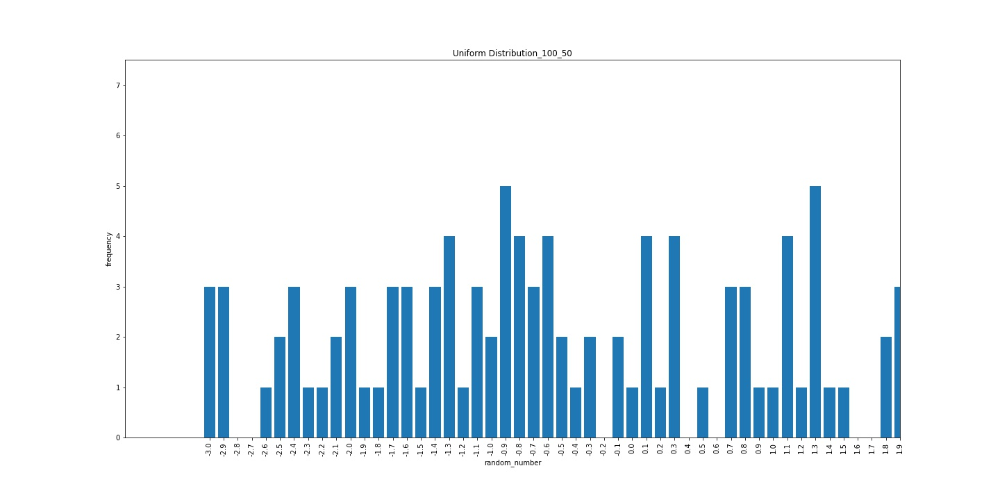
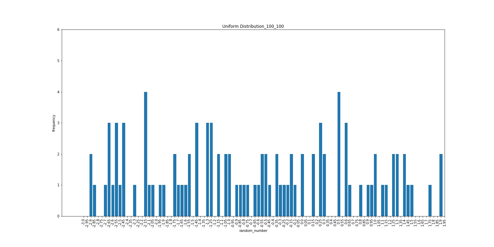
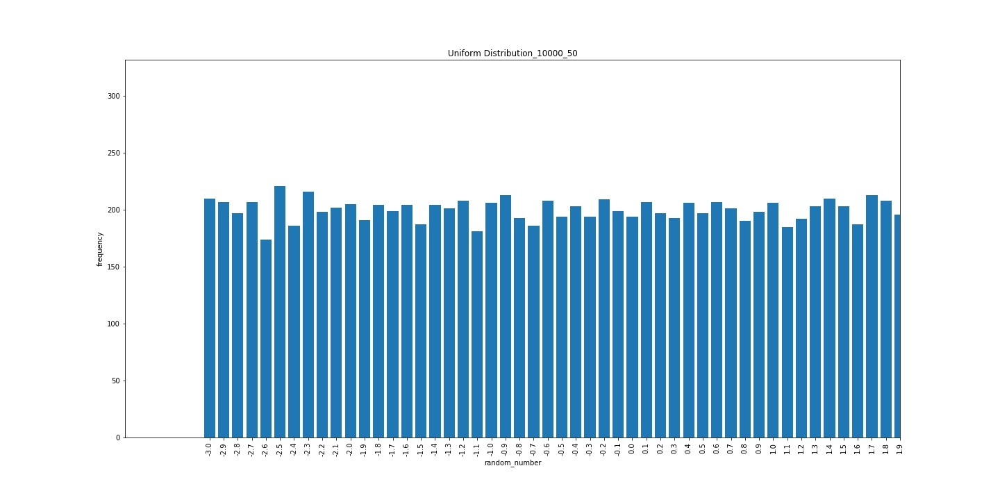
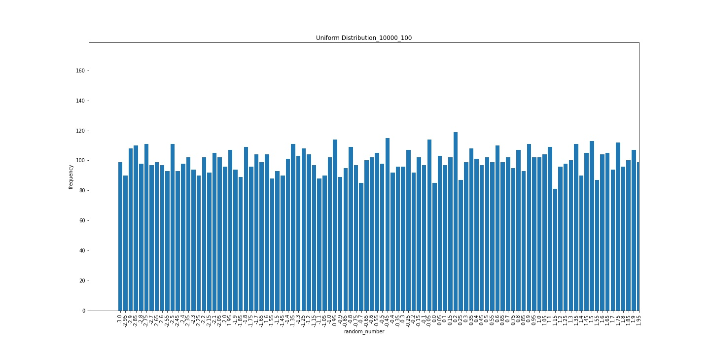
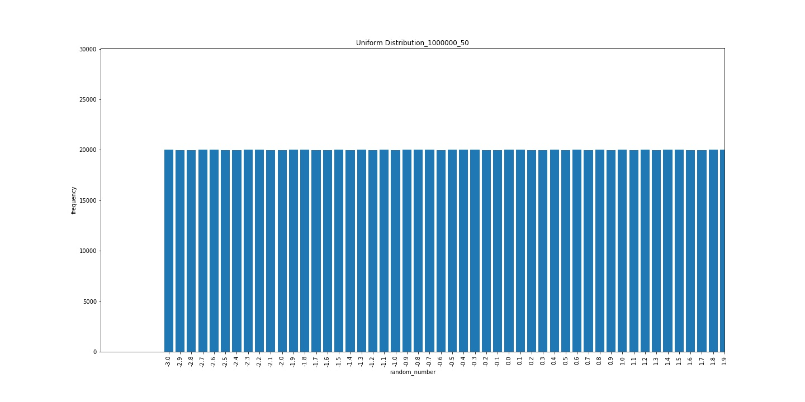
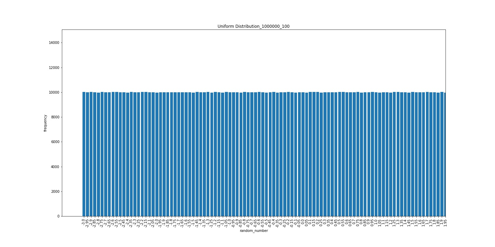

