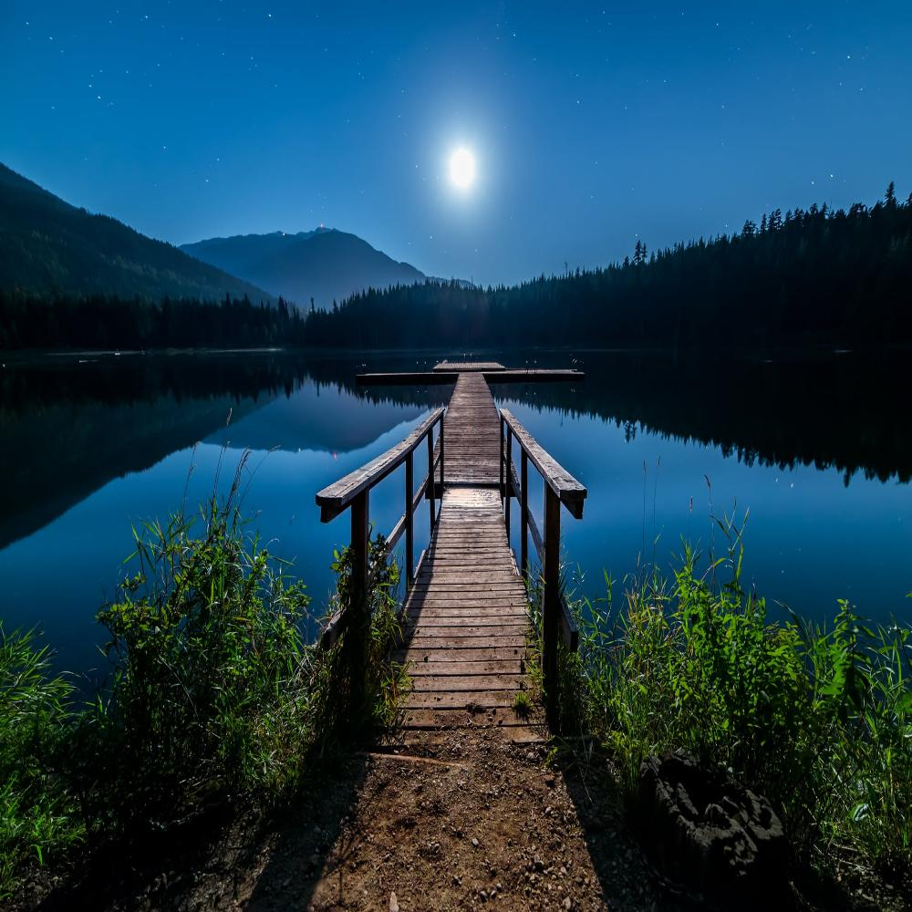
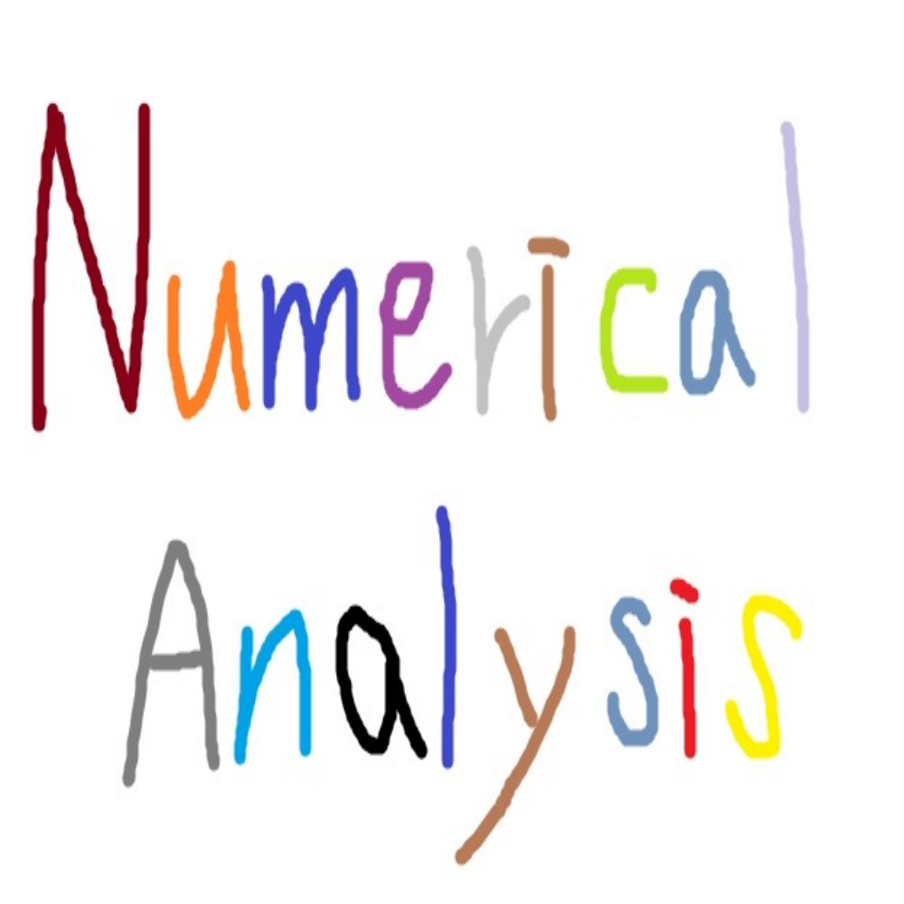

# Numerical Analysis

## hw8
- Load image file and Resize using bilinearinterpolation method


### Quick Start
```
jupyter notebook
or
python interpolation.py
```
opencv 모듈 설치에 에러가 많이 발생하여 파이썬, 쥬피터노트북을 활용하여 작성했습니다.
interpolation.ipynb 파일을 실행시켜 결과를 확인할 수 있습니다.
jupyter notebook 최상단의 filename, height, width값을 수정하여 코드를 테스트할 수 있습니다.

### Report

##### Requirements
```
opencv-python
numpy
math
pillow
matplotlib
```

##### 코드설명
```
src = cv2.imread(filename, cv2.IMREAD_COLOR)
src = cv2.cvtColor(src, cv2.COLOR_BGR2RGB)

def Interpolation(x1, x2, d1, d2):
    return d2*x1+d1*x2
    
def BilinearInterpolation(src, dest_height, dest_width):
    src_height,src_width=src.shape[:2]
                
    dest = np.array([[[0]*3 for j in range(dest_width)] for i in range(dest_height)]).astype(np.uint8)
    for i in range(dest_height):
        for j in range(dest_width):
            x=i*(src_height-1)/(dest_height-1)
            y=j*(src_width-1)/(dest_width-1)
            
            x1=int(math.floor(x))
            x2=int(math.ceil(x))
            y1=int(math.floor(y))
            y2=int(math.ceil(y))
            
            h1=x-x1
            h2=1-h1
            w1=y-y1
            w2=1-w1

            i1 = Interpolation(src[x1][y1], src[x2][y1], h1, h2).astype(np.uint8)
            i2 = Interpolation(src[x1][y2], src[x2][y2], h1, h2).astype(np.uint8)
            dest[i][j]=Interpolation(i1, i2, w1, w2).astype(np.uint8)

    return dest
    
```
opencv는 과거 카메라의 영상인식 방식을 토대로 만들어진 라이브러리여서 현대이미지 규격인 rgb가 아닌 bgr 방식으로 이미지를 읽어옵니다. 따라서 COLOR_BGR2RGB 를 사용하여 이미지 규격을 rgb방식으로 변환했습니다.     
bilinear interpolation 함수에서 새로 만들어지는 이미지의 (i,j)좌표의 픽셀정보를 확인하기 위해 원본이미지에서 어느 부분에 위치했는지 계산했습니다. 그것이 (x,y)입니다. 실수형 좌표인(x,y)를 감싸고 있는 네 개의 정수형 좌표(x1,y1), (x1,y2), (x2,y1), (x2,y2)값을 찾아서 bilinear interpolation 개념을 사용해서 픽셀값을 추론했습니다.

#### 시행착오
```
x=i*(src_height)/(dest_height)
y=j*(src_width)/(dest_width)
            
x=i*(src_height-1)/(dest_height-1)
y=j*(src_width-1)/(dest_width-1)
```
초반에 예외케이스를 고려하지 않고 위와같이 작성하였다가 index범위를 벗어나는 케이스를 겪었습니다. 후에 코드를 수정하여 해결했습니다.

##### Result


