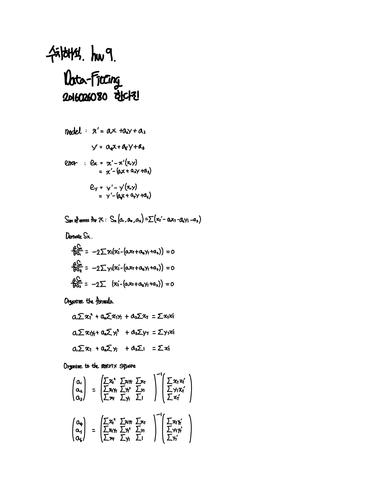

# Numerical Analysis

## hw9
- Data Fitting with least-square  

#### Quick Start
```
cd hw9
gcc -o main main.c -lm
./main

or

cd hw9
gcc -o main main.c -lm
main
```

#### Report   
전체 코드는 노트에 정리한 내용을 수식으로 구현했습니다.   
구체적인 수식이 이끌어지는 과정은 이미지로 첨부했습니다.   


<object data="imgs/Numerical_Analysis_hw9_formula.pdf" type="application/pdf" width="700px" height="700px">
    <embed src="imgs/Numerical_Analysis_hw9_formula.pdf">
        <p>This browser does not support PDFs. Please download the PDF to view it: <a href="imgs/Numerical_Analysis_hw9_formula.pdf">Download PDF</a>.</p>
    </embed>
</object>
